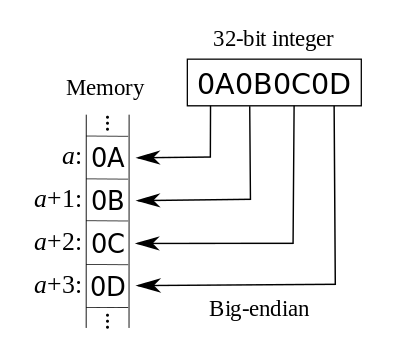

# Endian

Endianness refers to the sequential order used to numerically interpret 
**a range of bytes** in **computer memory** as larger, composed word value.
It also describes the order of byte transmission over a **digital link**.

However, if you have a 32-bit register storing a 32-bit value, it makes no 
to talk about endianness. The righmost bit is the least significant bit,
and the leftmost bit is the most significant bit.


## Big Endian




## Little Endian


The little-endian system has the property that the same value can be read
from memory at different lengths without using different addresses. 
For example, a 32-bit memory location with content 4A 00 00 00 can be read
at the same address as either 8-bit (value = 4A), 16-bit (004A), 24-bit 
(00004A), or 32-bit (0000004A), all of which retain the same numeric value.


## Bit Swapping

Some CPU instruction sets provide native support for endian swapping, 
such as __bswap__ (x86 and later), and __rev__ (ARMv6 and later).

Unicode text can optionally start with a __byte order mark__ (BOM) to 
signal the endianness of the file or stream. Its code point is *U+FEFF*. 
In UTF-32 for example, a big-endian file should start with ```00 00 FE FF```; a little endian should start with ```FF FE 00 00```.

Endianness doesn't apply to everything. If you do bitwise or bitshift 
operations on an int you don't notice the endianness.

TCP/IP are defined to be big-endian. The multi-byte integer representation 
used by the TCP/IP protocols is sometimes called __network byte order__.

In ```<arpa/inet.h>```:
* ```htons()```
Reorder the bytes of a 16-bit unsigned value from processor order to network order. The macro name can be read as "host to network short."

* ```htonl()```
Reorder the bytes of a 32-bit unsigned value from processor order to network order. The macro name can be read as "host to network long."

* ```ntohs()```
Reorder the bytes of a 16-bit unsigned value from network order to processor order. The macro name can be read as "network to host short."

* ```ntohl()```
Reorder the bytes of a 32-bit unsigned value from network order to processor order. The macro name can be read as "network to host long."


## Tools
* [hexdump] on Unix-like system

# References
* [Endianness](https://en.wikipedia.org/wiki/Endianness)
* [Big and Little Endian](https://www.cs.umd.edu/class/sum2003/cmsc311/Notes/Data/endian.html)
* [Writing endian-independent code in C](https://www.ibm.com/developerworks/aix/library/au-endianc/index.html?ca=drs-)
* [Understanding Big and Little Endian Byte Order](https://betterexplained.com/articles/understanding-big-and-little-endian-byte-order/)
